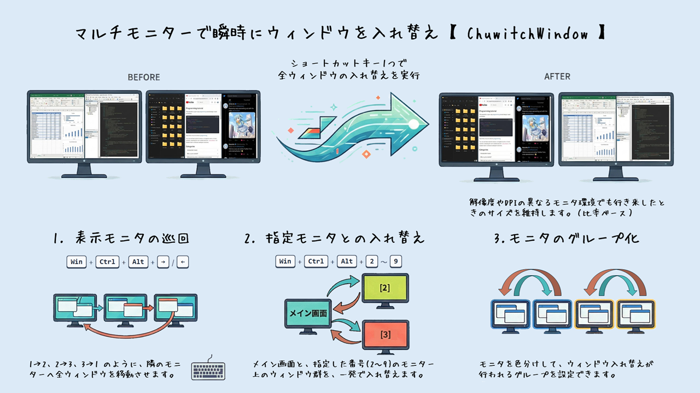

#  ChuwitchWindow - ウィンドウ配置入れ替えツール

本ツールは、マルチモニター環境向けの **ウィンドウ配置入れ替えツール** です。  
ショートカットキー一発で、開いているウィンドウ群を別のディスプレイへ一斉に移動・交換・巡回できます。

言い換えれば、マルチモニタ環境におけるデスクトップの秩序を維持するためのツールです。

## プロジェクト概要

本プロジェクトは、AIと協力して以下の工程で開発を行いました。

1. 開発に至った背景 : [BACK.md](docs/BACK.md)
2. 仕様書 (v0.1) : [SPECv0.1.md](docs/SPECv0.1.md)
3. 仕様書 (v0.2) : [SPECv0.2.md](docs/SPECv0.2.md)
4. AIコーディング : [DEV.md](docs/DEV.md)

本書では、基本的な操作説明のみを行います。

## ✨ 主な機能



| 機能                               | 説明                                                       | デフォルトキー                  |
| ---------------------------------- | ---------------------------------------------------------- | ------------------------------- |
| **巡回シフト（増加方向）**         | 全ウィンドウを次のモニターへ移動（1→2→3→1）                | `Win` + `Ctrl` + `Alt` + `→`    |
| **巡回シフト（減少方向）**         | 全ウィンドウを前のモニターへ移動（1→3→2→1）                | `Win` + `Ctrl` + `Alt` + `←`    |
| **指定モニターとの入れ替え**       | プライマリモニターと指定番号のモニター間でウィンドウを交換 | `Win` + `Ctrl` + `Alt` + `2〜9` |
| **Undo（元に戻す）**               | 直前の入れ替え操作を取り消し                               | `Win` + `Ctrl` + `Alt` + `Z`    |
| **ピン留め**【v0.2】               | アクティブなウィンドウを現在のモニターに固定する           | `Win` + `Ctrl` + `Alt` + `P`    |
| **エスケープ（一斉退避）**【v0.2】 | アクティブモニターの全ウィンドウをプライマリモニターへ移動 | `Win` + `Ctrl` + `Alt` + `E`    |
| **ギャザー（一極集中）**【v0.2】   | 全ウィンドウをアクティブモニターへ一箇所に集約する         | `Win` + `Ctrl` + `Alt` + `G`    |
| **自動整列**【v0.2】               | ウィンドウを均等配置するメニューを表示する                 | `Win` + `Ctrl` + `Alt` + `A`    |
| **モニターグループ設定**           | 同じグループのモニター間のみで入れ替えを実行               | —                               |
| **除外ウィンドウ設定**【v0.2】     | アプリケーション名等で移動対象から永続的に除外             | —                               |
| **外部アプリ連携**【v0.2】         | マクロパッド(Stream Deck等)から実行時引数で本アプリを操作  | —                               |

## 🖥️ 対応環境

- **OS**: Windows 10 / 11
- **必要要件**: 特になし（単体 `.exe` で動作）

## 📦 インストール

アプリの一覧へインストールしたくない方／できない方のために、EXEのZIP版とインストール版を用意しています。

### 軽く試してみたい方

1. [Releases](https://github.com/KotorinChunChun/ChuwitchWindow/releases) のAssetsから `*.zip` をダウンロード
2. `*.zip` を解凍して `ChuwitchWindow.exe` ファイルを直接実行

### 本格的に利用したい方（スタートアップに登録したい方はこちらを推奨）

1. [Releases](https://github.com/KotorinChunChun/ChuwitchWindow/releases) のAssetsから `*.setup.exe` をダウンロード
2. `*.setup.exe` を実行してインストール
   - スタートメニューやデスクトップにショートカットが作成されます。
   - Windowsの【設定】の【アプリ】の【インストールされているアプリ】からアンインストールが可能です。

## 🚀 使い方

### 基本操作

1. アプリを起動するとタスクトレイに常駐します
2. ショートカットキーでウィンドウの入れ替えを実行できます
3. 設定画面では、ショートカットキーのカスタマイズやモニターグループの設定が行えます

### 【v0.2】エスケープ（退避）とギャザー（一極集中）の使用例

- **エスケープ（退避）**: オンラインミーティングで特定のモニター（例：モニター2）を画面共有する直前に使用します。モニター2をアクティブにしてショートカットキー（`Win+Ctrl+Alt+E`）を押すと、モニター2にある全ウィンドウが他のモニターへサッと逃げ、クリーンなデスクトップを映すことができます。
- **ギャザー（一極集中）**: 作業の区切りがついたとき、散らばった全てのウィンドウをとりあえず手元のモニターに集めたい場合に使用します。手元のモニターをアクティブにしてショートカットキー（`Win+Ctrl+Alt+G`）を押すと、全ウィンドウが一箇所に集まります。

### 【v0.2】除外アプリの登録手順

特定アプリ（OBSやDiscordなど）を移動対象から永続的に外すルールを作る場合、以下のフローが便利です。

1. まず、除外したいウィンドウをアクティブにしてショートカットキー（`Win+Ctrl+Alt+P`）を押し、**一時ピン留め**状態にします。
2. 次に設定画面を開き、「除外リスト」タブを開きます。
3. すでにピン留めされているウィンドウが提案されるため、そのままルールに追加することで手軽に除外リストへ登録できます。

### 【v0.2】CLIからの実行（外部アプリ連携）

Stream Deckなどのマクロパッドや自作スクリプトから、実行時引数をつけて呼び出すことで連携操作が可能です。
事前に設定画面の「アプリについて」タブから「CLI用Path環境変数」を追加しておくと、フルパスを指定せずに実行できます。

**実行例:**

```powershell
# モニター間を巡回シフトする
ChuwitchWindow --shift-next

# モニター1とモニター2を入れ替える
ChuwitchWindow --swap 1 2
```

※ 既にアプリが常駐している場合はコマンドだけを送信して即座に終了し、常駐していない場合は処理を1回だけ実行して即座に終了（ワンショット実行）します。

### トレイアイコン

| 操作                | 動作           |
| ------------------- | -------------- |
| ダブルクリック      | 設定画面を表示 |
| 右クリック → 設定   | 設定画面を表示 |
| 右クリック → 再起動 | アプリを再起動 |
| 右クリック → 終了   | アプリを終了   |


### ウィンドウの動作

- **閉じる（×ボタン）** → タスクトレイに格納（アプリは終了しません）
- **最小化** → タスクトレイに格納

### 設定画面

設定画面は4つのタブで構成されています。

- **モニター構成**: モニターの物理配置をグラフィカルに表示。クリックでグループ色を変更し、同じ色のモニター間でウィンドウを一斉交換できます。
- **設定・常駐**: ショートカットキーの変更、スタートアップ登録、最小化ウィンドウの対象外設定【v0.2】、動作設定を行います。
- **除外リスト**【v0.2】: 「Discord」や「OBS」など、常に移動対象から外すアプリをプロセス名等で条件登録し、一連の動きから除外します。
- **アプリについて**: バージョン情報、公開場所(GitHub)へのリンク、設定ファイルのインポート/エクスポート【v0.2】、CLI用Pathの追加登録【v0.2】があります。

設定は `%APPDATA%\com.kotorichun\chuwitchwindow\config.json` に自動保存されます。

### モニタ構成

- プライマリモニターを選択できます。（プライマリモニタは、任意のモニタと交換できるようになります）
- モニタにグループ色を設定できます。（同じ色のモニター間でウィンドウを一斉交換できるようになります）
- 順位を設定できます。（巡回シフトの順番を変更できます）


### 設定・常駐

- 自動起動の登録ができます。
- ショートカットキーの設定ができます。
- グループ内での入れ替えを行うかモード切替ができます。
- フルクリーンアプリの扱いを変更できます。
- 【v0.2】最小化されたウィンドウを移動対象から除外するか設定できます。


### 🛡️ 管理者権限について

- 通常は一般ユーザー権限で動作しますが、その場合は管理者権限で実行されているアプリを移動させることができません。
- 管理者権限ウィンドウも操作対象にしたい場合は、設定画面から **「管理者として再起動する」** を実行してください。
- スタートアップの登録・解除にも管理者権限が必要です。

## 利用条件

- 本ツールはフリーウェアです。無制限にご利用頂けます。
- 本ツールを使用したことにより発生したいかなる損害も作者は責任を負いません。
- Rust未経験者がAIを頼りに書いているため、コード品質については期待しないでください。
- バグや追加して欲しい機能などがあれば、GitHubのIssuesやTwitterなどでお声掛けください。

## 👤 作者

**ことりちゅん** ([@KotorinChunChun](https://github.com/KotorinChunChun))


